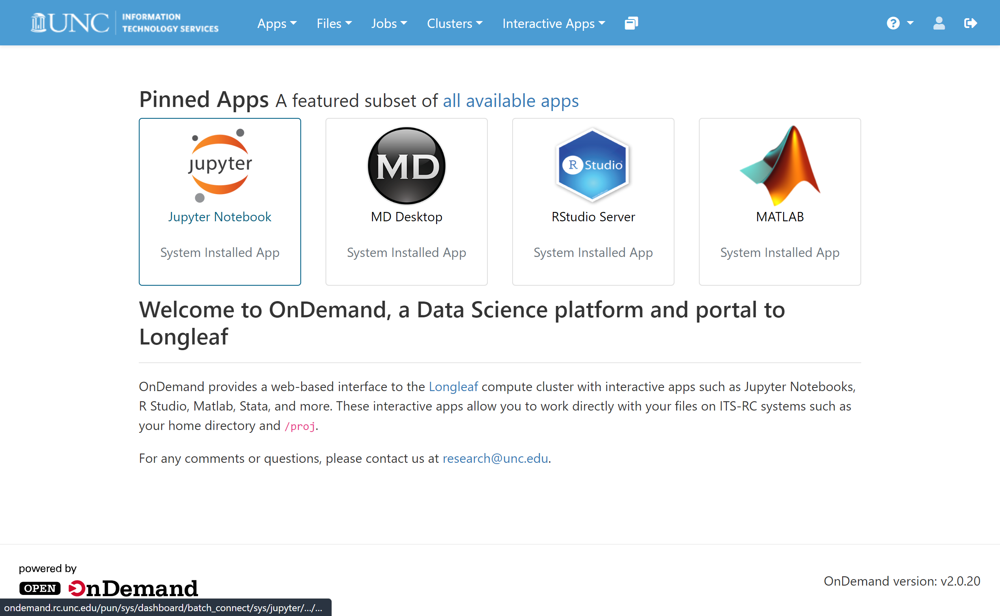
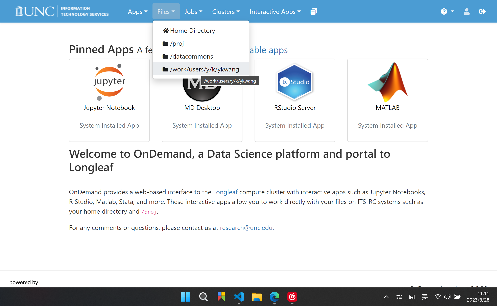
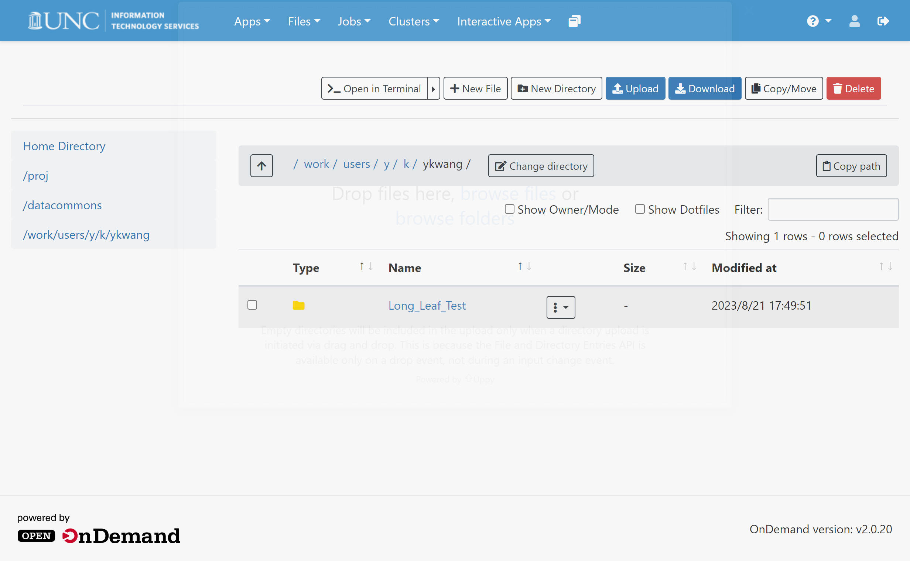
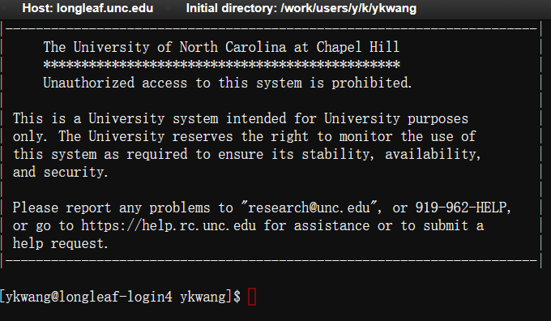
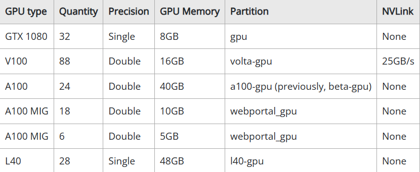

# Some Guides on LONGLEAF

## 1. Register

Just go to [REQUEST A CLUSTER ACCOUNT (unc.edu)](https://help.rc.unc.edu/request-a-cluster-account). The instructions are pretty clear. Normally it takes a day or two to be approved.

## 2. What is the Longleaf?

> The Longleaf cluster is a Linux-based computing system available to researchers across the campus free of charge. With nearly 6500 conventional compute cores delivering 13,000 threads (hyperthreading is enabled) and a large, fast scratch disk space, it provides an environment that is optimized for memory and I/O intensive, loosely coupled workloads with an emphasis on aggregate job throughput over individual job performance. In particular, workloads consisting of a large number of jobs each requiring a single compute host are best suited to Longleaf. The Longleaf cluster is targeted for data science and statistical computing workloads, very large memory jobs, and GPU computing. Resources are managed through a fair-share algorithm using SLURM as the resource manager/job scheduler.

In short words, it is a computing resource with GPU clusters available.

## 3. Log in

There are several ways of logging in to the system. I think for the most of us, the easieast way is to use "ONDEMAND" [OPEN ONDEMAND (unc.edu)](https://help.rc.unc.edu/ondemand). This is an online platform that does not need a Linux virtual machine on our computer.



If you still need to log in the system using Linux, Windows or Mac, refer to this page: [GETTING STARTED ON LONGLEAF (unc.edu)](https://help.rc.unc.edu/getting-started-on-longleaf/#logging-in)

## 4. Directory

All we need to do is place our project under this directory: **/work/users/`<o>`/`<n>`/`<onyen>`** (the“o/n/”are the first two letters of your ONYEN) with a quota of 30 TB.

**/work** is built for high-throughput and data-intensive computing, and intended for data actively being computed on, accessed and processed.

For inactive data, please move it to **/proj.**

For more information, visit [GETTING STARTED ON LONGLEAF (unc.edu)](https://help.rc.unc.edu/getting-started-on-longleaf/#main-directory-spaces)

## 5. Run a Project

### (1) Go into the directory

Click 'Files' button on the top and select a directory.



### (2) Upload the Files

Click the blue 'Upload' button and select all the files you need to upload.



### (3) Open a Terminal

First Click the 'Open in Terminal' button. And a terminal will pop out.



Here are some useful commands that we may need.

```shell
# This is used to view current directory position
ls

# This is used to enter a different directory
cd ./path
cd ..
cd ~

# This is used to delete a file or a file holder
rm -rf ./file
```

### (4) Set Environment

Now suppose you are exactly at the directory that the project locates.

First, load modules that we need.

We can view modules as some applications in the server. But we do not need all of them. Therefore, we only need to load the modules that we want. Refer to [MODULES APPROACH TO SOFTWARE MANAGEMENT (unc.edu)](https://help.rc.unc.edu/modules)

```shell
# This is used to remove all currently loaded modules and reset the environment to a clean state. 
# It unloads all modules that were previously loaded, allowing you to start with a fresh environment.
module purge

# This is used to check the availablity of different python versions.
module avail python

# This is used to load the modules
module load python/3.8.8
module load cuda

# This is used to save the current environment for future.
# Meaning next time you log into the system, this environment has been set up already.
module save

# You can use this command to check the python version
python --version

# This is used to view all the loaded packages
module list
```

Then, we need to create a virtual python environment for this particular project.

Though the server has everything in it, it's inappropriate to directly install some packages that we need on the server's python environment. (Actually we are not allowed to do this. Because firstly we need a sudo password to do this 'install' operation, which we don't have; Secondly if we can operate directly on the server, it's too dangerous.) Therefore, let's create a virtual environment.

```shell
# Create a virtual python environment in the current directory called my_env
python3 -m venv my_env

# Activate the virtual environment using the source command:
source my_env/bin/activate
```

Of course, you can use conda to create environments if you like. In that case, you need to first 'module load conda'.

Next, install all the packages that we need for this project.

For example

```shell
pip install pytorch
pip install datasets
pip install transformers
```

You can use this command to run the codes locally to test if any errors or warnings occurs.

```shell
python filename
```

### (5) Submit to the GPU

We have to write a shell script to inform GPU our operations exactly. We call it 'submitting a job to GPU'.

```shell
# using NANO to create and edit the file
nano job.sh
```

In this job.sh file, write these contents:

```shell
#! /bin/bash

#SBATCH -N 1
#SBATCH -n 1
#SBATCH -p a100-gpu
#SBATCH --mem=3g
#SBATCH --qos gpu_access
#SBATCH --gres=gpu:1

module purge

module load python/3.8.8
module load cuda

source myenv/bin/activate

python Filename.py
```

The first line is to say that this script file is meant to be executed by bash interpreter. We do not need to change anythin in this line.

The above will submit the code (Filename.py) as a single task (–n 1), to a single node (–N 1), requesting GPU access (––qos gpu_access), to the a-100 GPU partition (–p a100-gpu), a 3 GB memory limit (––mem=3g) and requesting 1 GPU(––gres=gpu:1).

For more information on the parameters, go to [LONGLEAF SLURM EXAMPLES (unc.edu)](https://help.rc.unc.edu/longleaf-slurm-examples/#python-examples)

See the [GPU page](https://help.rc.unc.edu/gpu) for more details on GPUs. We can change the '#SBATCH -p' command parameter to different GPUs according the the 'partition' column in this picture.



Submit the job:

```shell
# Use the sbatch command to submit your job script to the scheduler
sbatch job.sh
```

Monitor the job:

```shell
squeue -u your_username
```

After running the code, there will be a new file automatically created called 'slurm-xxxxxx.out'. You can open this file to check outputs.

For multiple GPU use, currently it only allows TWO A100-GPU to work together. If more GPUs are needed, maybe we need to contact with the administration.

we can write multi-GPU job.sh code like this:

```
#!/bin/bash
#SBATCH --qos gpu_access
#SBATCH --partition=a100-gpu
#SBATCH --gres=gpu:2
#SBATCH --nodes=1
#SBATCH --ntasks-per-node=1
#SBATCH --cpus-per-task=2

module purge
module load python/3.8.8
module load cuda

source my_env/bin/activate

export MASTER_ADDR=$(hostname -i)
export MASTER_PORT=12345  # Choose any available port


WORLD_SIZE=2 CUDA_VISIBLE_DEVICES=0,1 torchrun \
--nproc_per_node=2 \
--master_port=12345 \
finetune.py \
--base_model 'decapoda-research/llama-7b-hf' \
--data_path 'trans_chinese_alpaca_data.json' \
--output_dir './lora-alpaca-zh'
```

Notice that if you are asking more than 1 GPU, make sure you indeed wrote codes for parallel processing by Pytorch or whatever techniques you are using.

Here, asking 2 cpus makes the i/o process faster. To use multiple GPUs, make sure to set the correct world_size and port. Maybe you need to edit the configuration file in your project, or you can use command lines to clarify the running auguments (like the codes above).
